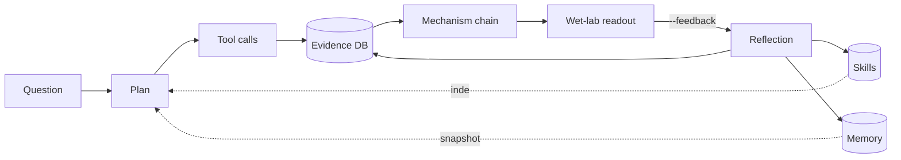

<h1 align="center">CytoPert</h1>

<p align="center">
An evidence-bound LLM agent for differential cell-state responses to perturbations.
</p>

<p align="center">
<b>English</b> · <a href="README.zh-CN.md">中文</a>
</p>

<p align="center">


</p>

---

CytoPert wraps the standard single-cell perturbation stack (scanpy, pertpy, decoupler, cellxgene Census) into an LLM agent that plans before it runs, cites every conclusion by an evidence ID, and accumulates skills, memory, and hypothesis state across sessions.

The same gene knockout can drive opposite outcomes in different cell states; the same stimulus pushes resting and effector T cells in opposite directions. Keeping that nuance straight by hand — flipping between notebooks, EndNote, and slides — gets exhausting fast. CytoPert exists to make that bookkeeping the agent's job.

CytoPert is **domain-agnostic**. The walkthrough and `nfatc1_mammary` workflow below happen to use a mammary-development example because it is a clean, reproducible scenario, but nothing in the codebase, prompts, or tool surface assumes a specific tissue, organism, perturbation modality, or disease. Plug in any organ / perturbation / disease by registering your own scenario or by talking to the agent directly.

## Design

Three things separate CytoPert from a regular chat interface.

**Evidence-bound.** Every conclusion the agent makes is tied to an evidence ID produced by a real tool call — a DE table, a perturbation distance, an enrichment hit. If no evidence is available, the agent stops and asks for data. It will not invent citations.

**Plan-before-execute.** For non-trivial requests the agent first lists the tools and parameters it intends to use and waits for a "go". This keeps token spend low and lets you steer the analysis at the cheapest point.

**Tool-driven, not hallucination-driven.** The LLM never invents a gene list. It calls `scanpy.tl.rank_genes_groups`, `pertpy.tl.distance`, `cellxgene-census` and so on, then reasons over the results. Numbers are reproducible; the reasoning trail is auditable.

## The learning loop

Most LLM agents forget everything when you close the window. CytoPert keeps four kinds of state on disk under `~/.cytopert/`.

- **Evidence DB.** Every `EvidenceEntry` produced by a tool call is persisted in SQLite + FTS5. The `evidence_search` tool retrieves prior results by gene, pathway, tissue, or free-text query, so a new session can cite a DE list you ran three weeks ago without re-running it.
- **Memory.** Three small markdown files — `CONTEXT.md`, `RESEARCHER.md`, `HYPOTHESIS_LOG.md` — hold environment notes, your output preferences, and a compact list of currently active mechanism chains. They are rendered into the system prompt at the start of each turn and never rewritten mid-turn (this preserves the LLM's prefix cache).
- **Skills.** [agentskills.io](https://agentskills.io)-compatible `SKILL.md` sheets describe reusable analysis procedures. Three are bundled with the install. The agent can propose new ones; proposals land in `skills/.staged/` and only become live after `cytopert skills accept`.
- **Mechanism chains.** Every chain submitted via the `chains` tool is persisted with a status state machine: `proposed → supported / refuted / superseded`. Each transition appends to a per-chain JSONL audit file.

After any turn that uses ≥5 tools, touches a chain, or carries a `--feedback` payload, the agent runs a brief reflection call on a fresh prompt. Depending on what it sees, it may write to memory, stage a skill, or push a chain through its lifecycle. The structure is borrowed from Nous Research's [Hermes Agent](https://github.com/NousResearch/hermes-agent) and adapted to single-cell research — the `HYPOTHESIS_LOG.md` and the chain state machine are the CytoPert-specific additions.



## Install

Python 3.11+ in a fresh conda environment is recommended.

```bash
conda create -n cytopert python=3.11 -y
conda activate cytopert
git clone https://github.com/your-org/CytoPert.git
cd CytoPert
pip install -e .
cytopert onboard
```

`onboard` creates `~/.cytopert/` with `config.json`, `workspace/`, `memory/`, `skills/` (seeded with the bundled SKILL.md sheets), and `chains/`.

## LLM provider configuration

CytoPert uses [LiteLLM](https://github.com/BerriAI/litellm) as the model client, so any OpenAI-compatible endpoint works. Open `~/.cytopert/config.json` and put your API key under one of the `providers.*` blocks. The first non-empty key wins (priority: `openrouter` → `deepseek` → `anthropic` → `openai` → `vllm`). Below are the four most common setups.

**OpenRouter** — one key, 200+ models, easiest to start with.

```json
{
  "providers": {
    "openrouter": {
      "apiKey": "sk-or-v1-...",
      "apiBase": "https://openrouter.ai/api/v1"
    }
  },
  "agents": { "defaults": { "model": "anthropic/claude-sonnet-4-20250514" } }
}
```

Sign up at [openrouter.ai/keys](https://openrouter.ai/keys); set a monthly spending cap from the dashboard before you start. Strong defaults: `anthropic/claude-sonnet-4-20250514`, `openai/gpt-5`, `google/gemini-2.5-pro`, `deepseek/deepseek-chat-v3.1`.

**DashScope (Aliyun Bailian)** — for users in mainland China. OpenAI-compatible, RMB billing, can issue invoices.

```json
{
  "providers": {
    "openai": {
      "apiKey": "sk-...",
      "apiBase": "https://dashscope.aliyuncs.com/compatible-mode/v1"
    }
  },
  "agents": { "defaults": { "model": "qwen3-max" } }
}
```

API keys at [bailian.console.aliyun.com](https://bailian.console.aliyun.com/). `qwen3-max` is the default; for harder reasoning, `qwen3-235b-a22b-thinking-2507`.

**DeepSeek** — the cheapest reliable option for routine workflow runs.

```json
{
  "providers": { "deepseek": { "apiKey": "sk-..." } },
  "agents": { "defaults": { "model": "deepseek-chat" } }
}
```

Keys at [platform.deepseek.com/api_keys](https://platform.deepseek.com/api_keys). Use `deepseek-chat` for general work, `deepseek-reasoner` when chains-of-thought help.

**Self-hosted vLLM** — when data must stay on-prem.

```json
{
  "providers": {
    "vllm": {
      "apiKey": "dummy",
      "apiBase": "http://your-server:8000/v1"
    }
  },
  "agents": { "defaults": { "model": "Qwen/Qwen3-30B-A3B-Instruct-2507" } }
}
```

Whatever model you pick must support OpenAI-style `tool_calls`. The DeepSeek path is exercised end-to-end by `tests/manual/run_deepseek_live.py`; the OpenRouter / DashScope / Anthropic / vLLM paths are LiteLLM-compatible but not part of the automated test matrix yet -- expect that the first run with a new model may need its own debug pass. Models that are known **not** to support OpenAI `tool_calls` (and therefore will not work) include early ChatGLM and some Llama 2 fine-tunes.

The remaining `agents.defaults` fields are `maxTokens` (8192 is enough for most turns), `temperature` (0.3 keeps mechanistic reasoning stable), and `maxToolIterations` (20 covers a full workflow). Run `cytopert status` to confirm the provider, model, and API key are picked up.

## A typical session

A one-shot question:

```bash
cytopert agent -m "Summarise the available tools and how you would approach a perturbation-vs-control DE on mammary luminal cells."
```

For real work, the interactive mode is more useful — it keeps a session ID so the agent can build context across turns:

```bash
cytopert agent -s mammary_nfatc1
```

A typical first turn looks like this:

```
You: I'd like to look at NFATC1 KO response across basal / luminal / stem
     mammary populations. List the plan first; I'll confirm before tools run.

CytoPert: Plan
  1. census_query (obs_only) to scout cell counts in mammary tissue
  2. census_query for <=20k cells AnnData (Census version 2025-11-08)
  3. scanpy_preprocess: HVG=2000, n_pcs=50
  4. scanpy_de per cell_type, NFATC1+ vs NFATC1-
  5. pathway_lookup against PROGENy / DoRothEA on the top DE genes
  6. chains for candidate mechanism summaries

You: go
... [tools run; depending on slice size, a few minutes]
```

Once the turn returns, `cytopert chains list` prints a table with one row per
chain (id, status, priority, first three evidence ids, summary head). Use the
companion CLI commands to inspect the side effects:

```bash
cytopert chains list                    # rich table; one row per chain
cytopert skills list --include-staged   # any skill the agent proposed
cytopert memory show -t hypothesis_log  # one line per chain transition
```

When wet-lab data comes back, push the verdict to the same session and the agent will move the chain through its state machine:

```bash
cytopert agent -s mammary_nfatc1 -m \
  "qPCR shows no NOTCH1 change after NFATC1 KO in basal (n=6, p=0.42). Mark chain_0001 refuted."
```

The agent calls `chain_status chain_id=chain_0001 status=refuted ...`, appends the event to `chains/chain_chain_0001.jsonl`, and updates `HYPOTHESIS_LOG.md`. In any future session, `evidence_search pathway=NOTCH` will surface the original evidence in its updated context, so you can build on the work without re-running anything.

## Tools

| Group              | Tools                                                                                  |
| ------------------ | -------------------------------------------------------------------------------------- |
| Data               | `census_query`, `load_local_h5ad`                                                      |
| Preprocessing & DE | `scanpy_preprocess`, `scanpy_cluster`, `scanpy_de`                                     |
| Reasoning          | `chains`, `chain_status`                                                               |
| Memory & skills    | `evidence`, `evidence_search`, `memory`, `skills_list`, `skill_view`, `skill_manage`   |

Full parameters in [docs/tools.md](docs/tools.md). Earlier alpha builds also
exposed `pertpy_*`, `decoupler_enrichment`, and `pathway_*` tools. They were
removed in stage 1 of the completeness overhaul because the underlying
handlers were stubs that returned guidance text instead of running the
analysis. A real `pathway_lookup` (backed by decoupler PROGENy / DoRothEA /
CollecTRI resources) lands in stage 7.2.

## Where things live

```
~/.cytopert/
├── config.json                # provider keys, model, defaults
├── workspace/                 # scanpy intermediate .h5ad files
├── sessions/                  # per-session JSONL transcripts
├── state.db                   # SQLite + FTS5: evidence + chains
├── memory/
│   ├── CONTEXT.md             # ≤2200 chars
│   ├── RESEARCHER.md          # ≤1375 chars
│   └── HYPOTHESIS_LOG.md      # ≤3000 chars; CytoPert-specific
├── skills/
│   ├── pipelines/...
│   ├── reasoning/...
│   └── .staged/               # agent-proposed, awaiting `cytopert skills accept`
└── chains/
    └── chain_<id>.jsonl       # per-chain audit trail
```

`CYTOPERT_HOME` overrides the root, which is useful when you want one isolated state per project.

## Common pitfalls

- **`cytopert status` says `API key: not set`.** Check that one of `providers.*.apiKey` is filled and that `config.json` is valid JSON. A stray single quote is the usual culprit.
- **Census queries time out.** Tighten `obs_value_filter` (prefer `tissue_ontology_term_id` over the loose `tissue` string), use `obs_only=true` first to scout cell counts, then set `max_cells` and a pinned `census_version` when you fetch the AnnData.
- **The model never calls a tool.** It does not support OpenAI `tool_calls`. The DeepSeek path is exercised by the live test suite; for other providers, double-check that the model card advertises function calling. Early ChatGLM and some Llama 2 fine-tunes are confirmed not to qualify.
- **The agent loops with "OK." replies.** The session history got contaminated. Type `/reset` in interactive mode or start a new session id.
- **Starting from scratch.** `rm -rf ~/.cytopert/` and re-run `cytopert onboard`.

More in [docs/troubleshooting.md](docs/troubleshooting.md).

## Documentation

- [docs/overview.md](docs/overview.md) — design principles and architecture
- [docs/quickstart.md](docs/quickstart.md) — command quick reference
- [docs/tools.md](docs/tools.md) — every tool with its parameters
- [docs/workflows.md](docs/workflows.md) — scenario workflows
- [docs/troubleshooting.md](docs/troubleshooting.md) — when things break

## Tests

```bash
pip install -e .[dev]
pytest -q
ruff check cytopert/ tests/
```

## Acknowledgements

CytoPert's agent loop and learning-loop architecture are adapted from
Nous Research's [Hermes Agent](https://github.com/NousResearch/hermes-agent)
(MIT). Specifically the `ToolRegistry`, `ContextEngine`, `ContextCompressor`,
`prompt_caching`, plugin discovery, and `trajectory` modules carry per-file
provenance headers and the upstream MIT license is preserved in
`references/hermes/` for diffability. See
[docs/hermes-borrowing.md](docs/hermes-borrowing.md) for the per-module
diff rationale and the pinned upstream commit. The single-cell stack is
[scverse](https://scverse.org/) (scanpy plus optional pertpy / decoupler
for downstream pathway lookups) and [CZ cellxgene Census](https://chanzuckerberg.github.io/cellxgene-census/).
Model access goes through [LiteLLM](https://github.com/BerriAI/litellm).
The skill format follows the [agentskills.io](https://agentskills.io)
open standard.

Issues, PRs, and new SKILL.md sheets are welcome.

## License

[Apache-2.0](LICENSE).
