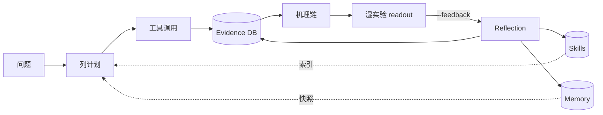

<h1 align="center">CytoPert</h1>

<p align="center">
以证据为约束的 LLM agent，用于解析单细胞扰动的状态依赖响应。
</p>

<p align="center">
<a href="README.md">English</a> · <b>中文</b>
</p>

<p align="center">


</p>

---

CytoPert 把 scanpy / pertpy / decoupler / cellxgene Census 这套 single-cell 分析栈封装成一个 LLM agent。它先列计划再调工具，每个结论必须挂在工具产出的 evidence ID 上，过程中沉淀的技能、记忆、机理假设都会持久化到本地，下一次会话里能直接复用。

做这个项目的动机其实不复杂：同一个 NFATC1 KO 在 basal 细胞里促分化、在 luminal 细胞里抑制；同一种刺激在静息和效应 T 细胞里走相反方向。把这种 state-dependent 的差异响应整理清楚，靠手工反复跑 notebook、查 EndNote、改 PPT 太累了——索性让 agent 来做这件事。

## 设计原则

**结论挂证据。** Agent 的每个机理结论都必须引用 evidence ID，证据来自工具产出（DE 表、扰动距离、富集结果，或被注册的文献）。没有证据就不能下结论，agent 会停下来要数据，不会编造引用。

**先计划再执行。** 复杂任务先给出计划——准备调哪几个工具、用什么参数——等用户确认再下手。这样 token 花得少，也方便用户在分析最便宜的环节就把方向掰过来。

**计算交给工具。** LLM 不去"算" DE 基因列表，而是调 `scanpy.tl.rank_genes_groups`、`pertpy.tl.distance`、`cellxgene-census` 这些真正的库，再对结果做推理。这样数字可复现、推理过程可审计。

## 学习闭环

普通 LLM agent 关掉窗口就忘光了，CytoPert 在 `~/.cytopert/` 下持久化四类状态：

- **Evidence DB**——工具调用产出的每条 `EvidenceEntry` 都进 SQLite + FTS5（一个支持全文检索的轻量数据库）。`evidence_search` 工具按基因、通路、组织或自由文本检索，新会话可以直接引用三周前跑过的 DE 列表，不用重跑。
- **Memory**——三个 markdown 文件 `CONTEXT.md` / `RESEARCHER.md` / `HYPOTHESIS_LOG.md`，分别记环境与工具偏好、用户输出习惯、当前活跃的机理假设。会话开始时被注入 system prompt，会话内不会被改写（保住 LLM 的 prefix cache）。
- **Skills**——兼容 [agentskills.io](https://agentskills.io) 的 `SKILL.md`，描述可复用的分析流程（如"扰动 DE 标准流程"）。仓库里附了三条种子；agent 可以提议新技能，先放在 `skills/.staged/`，由用户 `cytopert skills accept` 之后才正式入库。
- **机理链**——`chains` 工具提交的每条 MechanismChain 都进状态机：`proposed → supported / refuted / superseded`，每次状态变更追加到该 chain 的 JSONL 审计文件。

每次较复杂的轮次（≥5 个工具调用、动了某条 chain，或带 `--feedback` 跑），agent 会用一条干净的 prompt 跑一次反思 LLM 调用，可能写入 memory、提议 staged skill、推进 chain 状态。整体设计参考了 Nous Research 的 [Hermes Agent](https://github.com/NousResearch/hermes-agent)，在它的 self-improving 框架上做了 single-cell 学科化的裁剪——`HYPOTHESIS_LOG.md` 和 chain 状态机是 CytoPert 自己加的部分。



## 安装

建议 Python 3.11+，conda 环境。

```bash
conda create -n cytopert python=3.11 -y
conda activate cytopert
git clone https://github.com/your-org/CytoPert.git
cd CytoPert
pip install -e .
cytopert onboard
```

`onboard` 会在 `~/.cytopert/` 下生成 `config.json`、`workspace/`、`memory/`、`skills/`（连同 bundled 的三条 SKILL.md）和 `chains/`。

## LLM provider 配置

CytoPert 通过 [LiteLLM](https://github.com/BerriAI/litellm) 接 LLM，支持任何 OpenAI 兼容协议。编辑 `~/.cytopert/config.json`，在 `providers.*` 任一块下填 `apiKey`（优先级：`openrouter` → `deepseek` → `anthropic` → `openai` → `vllm`）。下面四种是常见选择。

**OpenRouter**：一个 key 通吃 200+ 模型，新手最省事。

```json
{
  "providers": {
    "openrouter": {
      "apiKey": "sk-or-v1-...",
      "apiBase": "https://openrouter.ai/api/v1"
    }
  },
  "agents": { "defaults": { "model": "anthropic/claude-sonnet-4-20250514" } }
}
```

去 [openrouter.ai/keys](https://openrouter.ai/keys) 注册并充值，建议先在后台设个月度预算上限。常用模型：`anthropic/claude-sonnet-4-20250514`、`openai/gpt-5`、`google/gemini-2.5-pro`、`deepseek/deepseek-chat-v3.1`。

**DashScope（阿里云灵积）**：国内直连、人民币结算、可开发票，是大陆用户首选。

```json
{
  "providers": {
    "openai": {
      "apiKey": "sk-...",
      "apiBase": "https://dashscope.aliyuncs.com/compatible-mode/v1"
    }
  },
  "agents": { "defaults": { "model": "qwen3-max" } }
}
```

去 [bailian.console.aliyun.com](https://bailian.console.aliyun.com/) 申请 API-KEY。常规推理用 `qwen3-max`，更难的推理可以试 `qwen3-235b-a22b-thinking-2507`。

**DeepSeek**：常态化跑 workflow 的低成本选择。

```json
{
  "providers": { "deepseek": { "apiKey": "sk-..." } },
  "agents": { "defaults": { "model": "deepseek-chat" } }
}
```

去 [platform.deepseek.com/api_keys](https://platform.deepseek.com/api_keys) 申请。常规用 `deepseek-chat`，需要更强推理时换 `deepseek-reasoner`。

**实验室自建 vLLM**：数据不能出内网时用。

```json
{
  "providers": {
    "vllm": {
      "apiKey": "dummy",
      "apiBase": "http://your-server:8000/v1"
    }
  },
  "agents": { "defaults": { "model": "Qwen/Qwen3-30B-A3B-Instruct-2507" } }
}
```

不论哪个方案，模型必须支持 OpenAI 风格的 `tool_calls`（函数调用）。已验证可用：Qwen3 instruct 系列、DeepSeek V3 / V3.1、Claude / GPT / Gemini 系列、Kimi K2。早期 ChatGLM 和部分 Llama 2 微调版不支持。

`agents.defaults` 其余字段：`maxTokens`（默认 8192 够用）、`temperature`（推理任务建议 0.3）、`maxToolIterations`（默认 20，控制单轮最多连续调几次工具）。配好后跑一下 `cytopert status` 确认 provider、model 和 API key 都被识别。

## 一段示例

单次提问：

```bash
cytopert agent -m "简述一下你能用的工具，以及做一个 perturbation-vs-control DE 你会怎么走流程。"
```

实际工作里更常用交互模式——同一个 session ID 能让 agent 在多轮之间保持上下文：

```bash
cytopert agent -s mammary_nfatc1
```

第一轮典型对话：

```
You: 想看 NFATC1 KO 在 basal / luminal / stem 三个 mammary 群体的差异响应。
     先列计划，确认后再跑。

CytoPert: 计划
  1. census_query（obs_only）看 mammary tissue 的细胞数和注释
  2. census_query 拉 ≤20k cells 的 AnnData（Census 版本 2025-11-08）
  3. scanpy_preprocess：HVG=2000, n_pcs=50
  4. scanpy_de 按 cell_type，NFATC1+ vs NFATC1-
  5. decoupler_enrichment 富集 KEGG / DoRothEA
  6. chains 提交候选机理链

You: go
... [agent 调用 6 个工具，按数据切片大小约几分钟]

CytoPert: 三条候选机理链：
  chain_0001  NFATC1 → NOTCH → luminal 分化     (P1, evidence: e1, e3)
  chain_0002  NFATC1 → WNT  → basal 扩增         (P2, evidence: e2)
  chain_0003  NFATC1 → CTLA4 → stem 静息         (P2, evidence: e4)
```

这一轮调了 6 个工具，触发反思 hook。结束后看一眼：

```bash
cytopert chains list                    # 三条新的 chain
cytopert skills list --include-staged   # agent 提议的 staged skill（如 mammary-nfatc1-de）
cytopert memory show -t hypothesis_log  # 假设日志里多了几行
```

湿实验跑完之后，把结论丢回同一个 session，agent 会自动推进状态机：

```bash
cytopert agent -s mammary_nfatc1 -m \
  "qPCR 显示 NFATC1 KO 后 basal 细胞 NOTCH1 mRNA 无显著变化（n=6, p=0.42）。
   把 chain_0001 标记为 refuted。"
```

Agent 会调用 `chain_status chain_id=chain_0001 status=refuted ...`，把事件追加到 `chains/chain_chain_0001.jsonl`，并更新 `HYPOTHESIS_LOG.md`。下次新会话里 `evidence_search pathway=NOTCH` 会带出原始证据和更新后的状态，方便在前面工作的基础上继续推进。

## 工具

| 类别                 | 工具                                                                                  |
| -------------------- | ------------------------------------------------------------------------------------- |
| 数据                 | `census_query`、`load_local_h5ad`                                                     |
| 预处理与差异分析     | `scanpy_preprocess`、`scanpy_cluster`、`scanpy_de`                                    |
| 扰动专用             | `pertpy_perturbation_distance`、`pertpy_differential_response`                        |
| 通路富集 / 约束      | `decoupler_enrichment`、`pathway_constraint`、`pathway_check`                         |
| 推理                 | `chains`、`chain_status`                                                              |
| 记忆与技能           | `evidence`、`evidence_search`、`memory`、`skills_list`、`skill_view`、`skill_manage`  |

完整参数见 [docs/tools.md](docs/tools.md)。

## 工作目录

```
~/.cytopert/
├── config.json                # provider keys、model、默认值
├── workspace/                 # scanpy 中间 .h5ad
├── sessions/                  # 每个会话的 JSONL 历史
├── state.db                   # SQLite + FTS5：evidence + chains
├── memory/
│   ├── CONTEXT.md             # ≤2200 字符
│   ├── RESEARCHER.md          # ≤1375 字符
│   └── HYPOTHESIS_LOG.md      # ≤3000 字符；CytoPert 专属
├── skills/
│   ├── pipelines/...
│   ├── reasoning/...
│   └── .staged/               # agent 提议、待用户 accept
└── chains/
    └── chain_<id>.jsonl       # 每条 chain 的状态变更审计
```

`CYTOPERT_HOME` 环境变量可以改根目录，方便给不同课题做隔离。

## 常见问题

- **`cytopert status` 显示 `API key: not set`。** 检查 `providers.*.apiKey` 是否填了，以及 `config.json` 是否合法 JSON。最常见的错是把 `"sk-..."` 写成单引号。
- **Census 查询超时。** 收紧 `obs_value_filter`（用 `tissue_ontology_term_id` 比 `tissue` 字符串精确），先 `obs_only=true` 看细胞数，再设 `max_cells` 和 `census_version` 拉 AnnData。
- **模型不调工具。** 模型不支持 OpenAI 的 `tool_calls`。上面四种方案里推荐的模型都验证过；ChatGLM 早期版本和部分 Llama 2 微调不支持。
- **Agent 重复回 `OK.`。** 会话历史被带偏了，交互模式下 `/reset`，或换个 session id：`cytopert agent -s cli:fresh_$(date +%s)`。
- **想完全清空。** `rm -rf ~/.cytopert/` 然后重跑 `cytopert onboard`。

更多见 [docs/troubleshooting.md](docs/troubleshooting.md)。

## 文档

- [docs/overview.md](docs/overview.md)——设计原则与架构
- [docs/quickstart.md](docs/quickstart.md)——命令速查
- [docs/tools.md](docs/tools.md)——工具完整参数
- [docs/workflows.md](docs/workflows.md)——scenario workflow
- [docs/troubleshooting.md](docs/troubleshooting.md)——排错

## 测试

```bash
pip install -e .[dev]
pytest -q
ruff check cytopert/ tests/
```

## 致谢

self-improving 设计借鉴自 Nous Research 的 [Hermes Agent](https://github.com/NousResearch/hermes-agent)。Single-cell 栈基于 [scverse](https://scverse.org/)（scanpy / pertpy / decoupler）和 [CZ cellxgene Census](https://chanzuckerberg.github.io/cellxgene-census/)。模型接入通过 [LiteLLM](https://github.com/BerriAI/litellm)。SKILL.md 格式遵循 [agentskills.io](https://agentskills.io) 开放标准。

欢迎 issue、PR，特别欢迎贡献新的 SKILL.md 流程。

## License

[Apache-2.0](LICENSE)。
